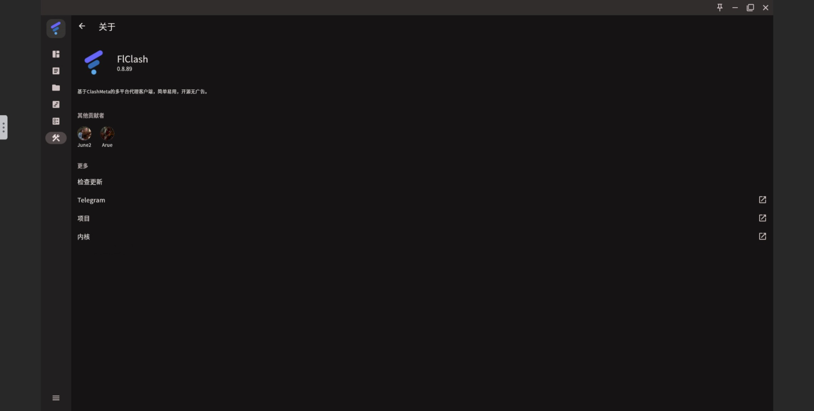

# flclash-docker

This project provides a Docker image for [FlClash](https://github.com/chen08209/FlClash).


## Screenshots



## Pulling the Image

You can pull the image from either Docker Hub or GitHub Container Registry:

### 1. Pull from Docker Hub

```bash
docker pull libzonda/flclash-docker:latest
```

### 2. Pull from GitHub Packages

```bash
docker pull ghcr.io/libzonda/flclash-docker:latest
```

## Running the Container

You can run the FlClash Docker container with compose:

```yaml
services:
  flclash-docker:
    image: libzonda/flclash-docker:latest
    container_name: flclash-docker
    network_mode: host
    volumes:
      - /run/dbus/system_bus_socket:/run/dbus/system_bus_socket
      - ./flclash:/config/xdg/data/com.follow.clash
    user: 0:0
    privileged: true
    cap_add:
      - NET_ADMIN
    devices:
      - /dev/net/tun # 挂载 TUN 设备
    environment:
      - TZ=Asia/Shanghai
    restart: unless-stopped
```

## Visit
[http://localhost:5800](http://localhost:5800)

## Acknowledgements

This project is based on the following excellent open-source projects (in no particular order):

- [@jlesage/docker-baseimage](https://github.com/jlesage/docker-baseimage): A powerful and stable Docker base image that greatly simplifies container development.
- [@chen08209/FlClash](https://github.com/chen08209/FlClash): The core application providing a feature-rich Clash Web UI.

Many thanks to the authors and maintainers for their dedication to open source!

---

For suggestions or issues, please feel free to open an issue.
